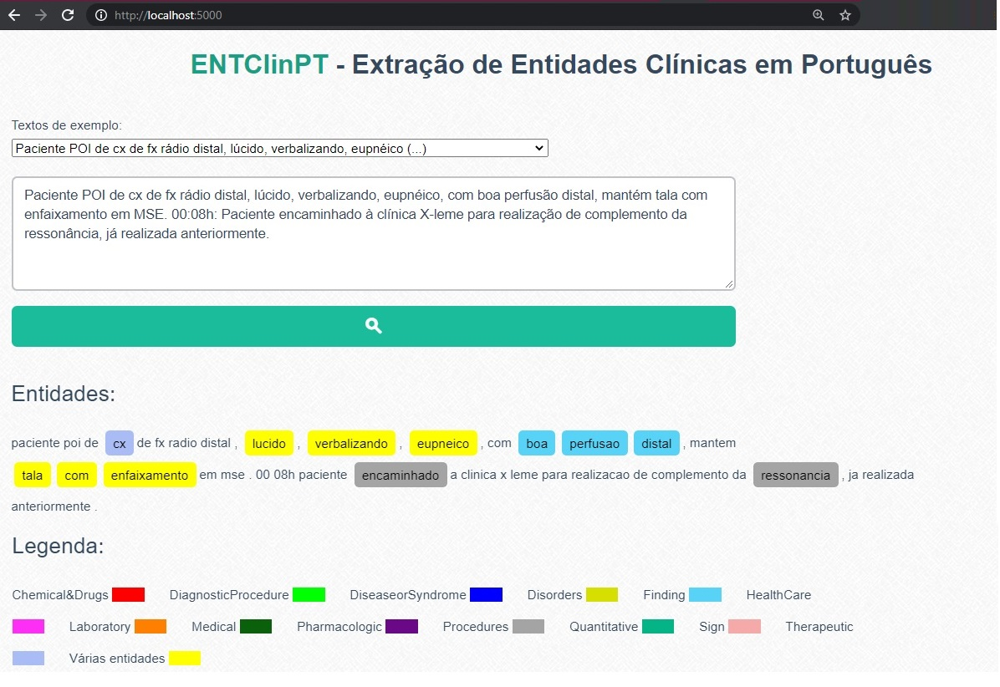
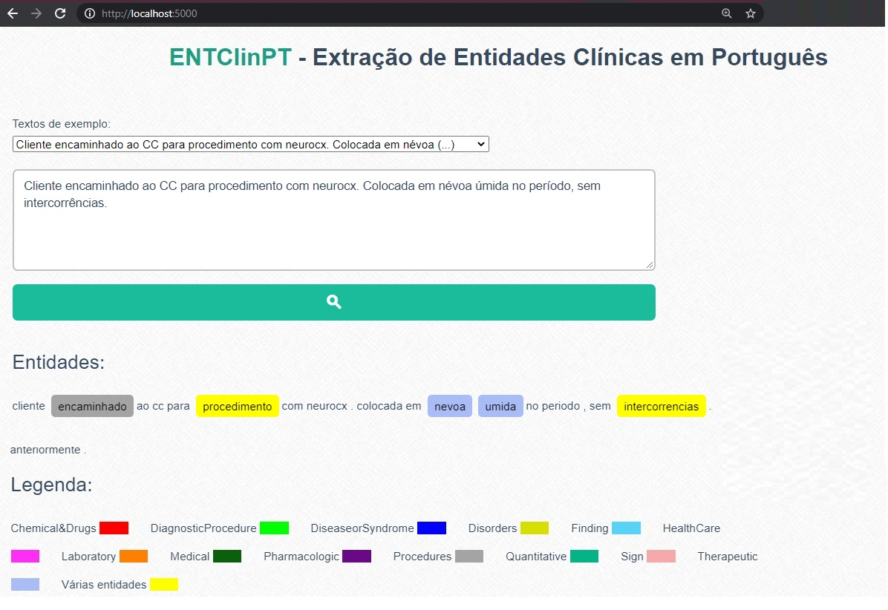
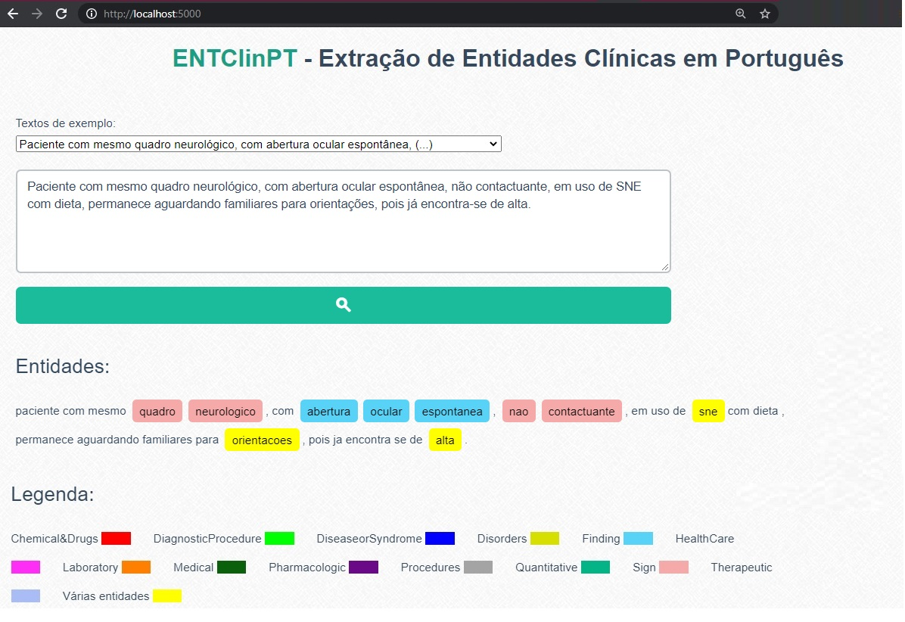
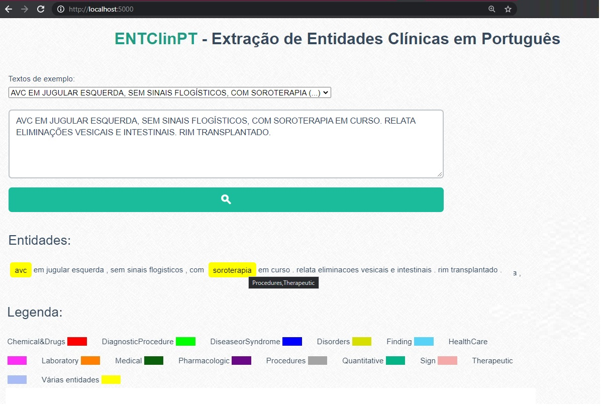
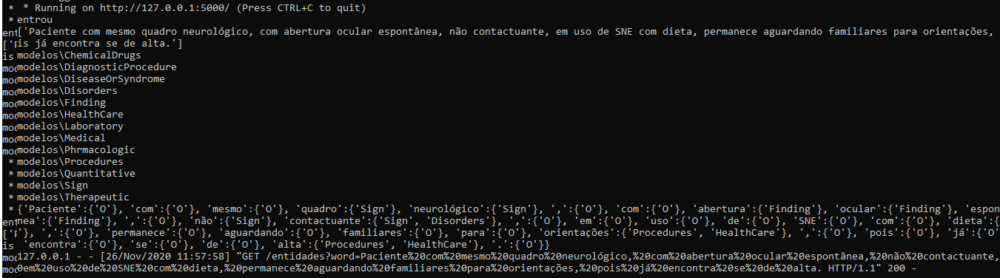

# ENTClinPT - Uma API para Extração de Entidades Clínicas em Português

** *trabalho em andamento* **

# Table of Contents
1. [Como executar localmente](#como-executar-localmente)
2. [Executando via docker](#executando-via-docker)
3. [Como citar](#como-citar)

## Como executar localmente
1. Clone o repositório
2. Instale as biblitecas necessárias (se preferir, use [Anaconda](http://www.anaconda.com))
```
pip install numpy
pip install transformers == 4.3.0
pip install torch==1.8.0+cpu torchvision==0.9.0+cpu torchaudio==0.8.0 -f https://download.pytorch.org/whl/torch_stable.html
pip install flask == 4.3.0
```
ou através do comnando:
```
pip install -r requirements.txt
```
3. Execute o app.py (está configurado para rodar na porta 5000)
```
python app.py
```
4. No navegador, acesse http://localhost:5000/

5. Escreve uma sentença clínica ou selecione alguma frase de exemplo e clicar no botão de pesquisa (lupa). 
 
Serão retornadas as entidades clínicas identificadas na sentença de entrada. Acommpanhe as cores pela legenda. O primeiro acesso pode ser mais lento, já que o(s) modelo(s) de NER serão baixados do repositório [HuggingFaces](https://huggingface.co/pucpr/clininalnerpt-finding). Tenha um pouquinho de paciência :)
 








Output da API:



5. Selecionando outros tipos de entidade

Para extrair as entidades dos tipos semânticos desejados, altere a lista ```MODELS_DIR``` no arquivo ```app.py```, indicando quais modelos de NER você deseja (por padrão configuramos o *Finding (achados clínicos)*). No arquivo ```predict_ner.py```, por favor altere a lista ```tags_values```, de acordo com o modelo escolhido.

## Executando via Docker

1. Para executar a API dentro de um container Docker, onde não é necessário se preocupar com o ambiente e bibliotecas, basta obter a imagem através do comando:

```
docker pull terumi/entclinpt:v1
```
Caso não possua, instale o Docker seguindo [essas orientações](https://docs.docker.com/get-started/).

Para mais detalhes, visite a página do repositório no DockerHub: https://hub.docker.com/r/terumi/entclinpt

2. Execute o seguinte comando (para executar o container na porta 5000)
```
docker run -p 0.0.0.0:5000:5000 terumi/entclinpt:v1
```
3. No navegador, acesse http://localhost:5000/

OBS: Configuramos a imagem para extrair entidades do tipo *Findings*, apenas como exemplo. Se você está familizarizado com o comando ```docker exec -it```, pode alterar o filtro alterando os arquivos diretamente dentro do container, conforme as instruções do passo "5- Selecionando outros tipos de entidade". Em breve isso será melhorado.

## Como citar

** *em breve* **

